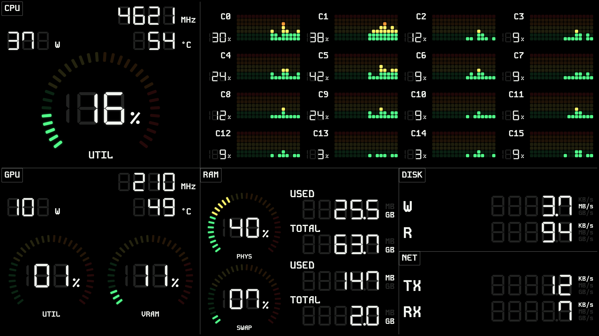

# Dashb

A small Windows app that runs a local web server and serves a real-time system
dashboard (CPU/GPU/RAM/network/disk) to any browser on your LAN. Point an old phone
or tablet at it and turn it into a permanent PC monitor — no app install needed on
the viewing device, just a browser.



## Features

- Runs from the system tray; start/stop the server without closing the app.
- Multiple selectable dashboard themes (a segmented LED/LCD theme is bundled), each
  installable as a home-screen PWA on the viewing device.
- Optional Basic Auth to restrict access.
- Elevated sensor access on Windows (via a bundled LibreHardwareMonitor helper) for
  readings that require admin rights, such as some CPU temperature/power sensors.
- Custom themes: install a theme from a `.zip`, or drop one into the user themes
  folder, from the GUI.

## Download and run

Grab the latest `Dashb-vX.Y.Z-win64.exe` from the [Releases](../../releases) page.
It's a single portable executable — no installer, nothing else to unpack.

1. Run the exe. Windows SmartScreen may warn that it's from an unrecognized
   publisher (the build isn't code-signed) — click **More info > Run anyway**.
2. Windows Firewall will likely prompt to allow network access the first time the
   server starts — allow it, or LAN devices won't be able to reach the dashboard.
3. On first sensor read, a UAC prompt may appear to elevate the bundled
   LibreHardwareMonitor helper. This is only needed for certain sensors (e.g. some
   CPU temperature/power readings); declining it still gives you the rest.
4. The app starts the server automatically and sits in the tray. Open
   `http://<this-pc's-LAN-IP>:8080` from another device on the same network to view
   the dashboard, or `http://localhost:8080` on the same machine.

Host, port, and Basic Auth can be changed from **Settings** in the GUI window
(reopen the window by clicking the tray icon).

## Uninstalling

Dashb is portable and doesn't register itself as an installed program, so there's
nothing to remove from "Apps & features." To fully clean up:

1. Quit the app from its tray icon (or **Quit** in the main window).
2. Delete the `Dashb.exe` file you downloaded.
3. Optional — remove leftover user data:
   - Installed themes: `%APPDATA%\dashb\themes`
   - Saved settings (host/port/auth), stored in the registry rather than a file:
     `HKEY_CURRENT_USER\Software\MyApp\Dashb` (remove via `regedit`, or
     `reg delete "HKCU\Software\MyApp\Dashb" /f` in a terminal).

## Other platforms

Only Windows builds are published right now. The server and web themes are
cross-platform, but macOS/Linux packaging hasn't been set up and validated yet —
run from source (below) on those platforms in the meantime.

## Building from source

Requires [uv](https://docs.astral.sh/uv/), [Bun](https://bun.sh/), and the
[.NET 8 SDK](https://dotnet.microsoft.com/) (Windows only, for the sensor helper).

```powershell
# Web themes
cd web-app
bun install
bun run build
cd ..

# Elevated sensor helper (Windows only)
dotnet publish helpers/lhm-helper/Dashb.LhmHelper.csproj -c Release -r win-x64 --self-contained true

# Run from source
uv run python -m dashb
```

To produce a standalone `Dashb.exe` after the steps above:

```powershell
uv run pyinstaller dashb.spec --noconfirm
```

The build ends up at `dist/Dashb.exe`. A manually-triggered GitHub Actions workflow
(`.github/workflows/release.yml`) runs this same pipeline and publishes the result
as a GitHub Release.

## License

MIT — see [LICENSE](LICENSE).
